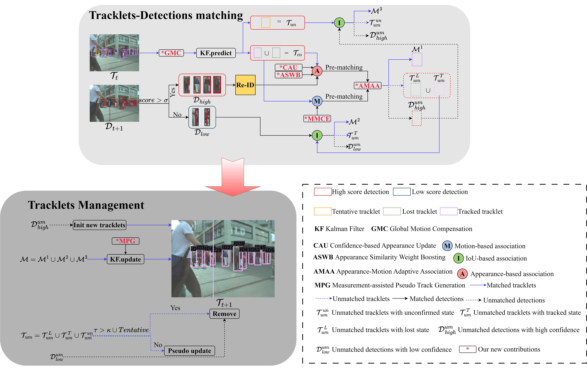

# MASORT

## Abstract
Human-centric video data and algorithms have been driving advances in Multi-Object Tracking (MOT) community. Most popular MOT methods follow the Detection-Based Tracking (DBT) paradigm and achieve impressive performance.  Simple Online and Realtime Tracking (SORT) serves as a foundational association algorithm is continuously optimized in subsequent researches. However, DBT methods still face 2 challenges. On the one hand, when a target suffers from occlusion for prolonged time, Kalman filter (KF)-based motion model trusts the prior state estimations to perform pseudo-updates, leading to significant motion variance. On the other hand, original association paradigms assume behavioral homogeneity among pedestrians and apply the same features for all items. This uniform treatment hinders the advantages of different features can not be fully utilized. To this end, we propose a Measurement-assisted Adaptive association (MASORT) for tracking multi-pedestrian with behavior discrepancies. MASORT adopts the 3-stage association framework of ByteTrack. To fully exploit the effectiveness of motion and Re-ID features, we introduce a Measurement-assisted Motion Enhancement (M2E) module and an Appearance Enhancement (AE) module. M2E improves KF via measurements instead of estimations and proposes a momentum-consistent motion similarity metric. AE dynamically updates Re-ID embeddings based on confidence scores and emphasizes persons with discriminative appearance. Furthermore, we design an Appearance-Motion Adaptive Association (AMAA) algorithm to accommodate behavior discrepancies among individuals. AMAA selects a  suitable feature based on each person’s motion level. Extensive experiments on 3 MOT benchmarks, including MOT17, MOT20 and DanceTrack, demonstrate that MASORT achieves the optimal trade-off between detection and association performance. On the challenging DanceTrack dataset, where the object appearance is highly similar, our MASORT  attains a remarkable 61.4 HOTA. 
<p align="center"></p> 

## News 

## Tracking performance
### Results on MOT challenge and DanceTrack test set

## Preliminary
### 1. Installing on your local machine ⌨
Step1. Install MASORT
```shell
git clone  https://github.com/YanJieWen/MASORT.git
pip  install -r requirements.txt
python setup.py develop
```
Step2. Install motmetrics
```shell
cd MASORT
pip install motmetrics
```

Step3. Install [TrackEval](https://github.com/JonathonLuiten/TrackEval)
```shell
cd external
git clone https://github.com/JonathonLuiten/TrackEval.git
cd TrackEval
pip install -v -e .
```

Step3. Install [Torchreid](https://github.com/KaiyangZhou/deep-person-reid)
```shell
cd external
git clone https://github.com/KaiyangZhou/deep-person-reid.git
cd deep-person-reid
pip install -r requirements.txt
python setup.py develop
```

Step4. Install [Fastreid](https://github.com/JDAI-CV/fast-reid)
```shell
cd external
git clone https://github.com/JDAI-CV/fast-reid.git
```

## Data preparation🔥
| MOTChallenge | DanceTrack |
|:-----------------:|:----------------:|
|[](https://motchallenge.net/)|[](https://github.com/DanceTrack/DanceTrack)|

Then, you need to turn the datasets to COCO format and mix different training data:

```shell
cd MASORT
python tools/convert_mot17_to_coco.py
python tools/convert_mot20_to_coco.py
python tools/convert_crowdhuman_to_coco.py
python tools/convert_cityperson_to_coco.py
python tools/convert_ethz_to_coco.py
```
It is worth noting that for the MOT17 test set, we uploaded the ``JSON`` file of [FRCNN](datasets/mot/test-FRCNN.json) to accelerate the evaluation.  

Subsequently, we perform file management operations as instructed in [tools/mix_xxx](tools), and run the following script:
```shell
cd MASORT
python tools/mix_data_ablation.py
python tools/mix_data_test_mot17.py
python tools/mix_data_test_mot20.py
```


## Model ZOO⭐
You can download the following detection and Re-ID weight, putting them into [pretrained/masortweight](pretrained/masortweight) and [pretrained/reid-model](pretrained/reid-model) folders,respectively. 
| Dataset         | HOTA | MOTA | IDF1 |  Model (Detection)                                                                                                                                                                | Model (Re-ID)
| --------------- | ---- | ---- | ---- |-------------------------------------------------------------------------------------------------------------------------------------------------------------------------------- | ---------------------------------------------------------------------------------------------------------------------------------------------------------------------- |
| MOT17-half-val  | 68.6 | 75.2 | 80.6 | masort_ablation.pth.tar [[baidu:csuw]](https://pan.baidu.com/s/1wXBDlMEIsJi6zGTxGBdkDg) | osnet_ain_ms_d_c.pth.tar [[baidu:csuh]](https://pan.baidu.com/s/1VaSlnfQGY6Pn_KU8IRYiXg)
| MOT17-test      | 64.8 | 78.9 | 78.9 | masort_mot17.pth.tar [[baidu:csuw]](https://pan.baidu.com/s/1wXBDlMEIsJi6zGTxGBdkDg) | mot17_sbs_S50.pth [[baidu:csuh]](https://pan.baidu.com/s/1VaSlnfQGY6Pn_KU8IRYiXg)
| MOT20-test      | 63.8 | 75.7 | 79.0 | masort_mot20.tar [[baidu:csuw]](https://pan.baidu.com/s/1wXBDlMEIsJi6zGTxGBdkDg) | mo20_sbs_S50.pth [[baidu:csuh]](https://pan.baidu.com/s/1VaSlnfQGY6Pn_KU8IRYiXg)
| DanceTrack-val  | 59.3 | 87.9 | 60.8 | masort_dance.pth.tar [[baidu:csuw]](https://pan.baidu.com/s/1wXBDlMEIsJi6zGTxGBdkDg) | dance_sbs_S50.pth [[baidu:csuh]](https://pan.baidu.com/s/1VaSlnfQGY6Pn_KU8IRYiXg)
| DanceTrack-test  | 61.4 | 90.6 | 63.6 | masort_dance.pth.tar [[baidu:csuw]](https://pan.baidu.com/s/1wXBDlMEIsJi6zGTxGBdkDg) | dance_sbs_S50.pth [[baidu:csuh]](https://pan.baidu.com/s/1VaSlnfQGY6Pn_KU8IRYiXg)
* It is important to place the Re-ID configuration file [mot17-sbs](external/mot17-sbs.yml) into [FastReID](external/fast-reid/configs). 
## How to Tracking⚡
Scripts are in [runs](runs)
```shell
sh runs/mot17-ablation.sh
sh runs/mot17-test.sh
sh runs/mot20-test.sh
sh runs/dance-val.sh
sh runs/dance-test.sh
```

## Demo 


## Citation
**Constructing...**

## Acknowledgement
A large part of the code is borrowed from [YOLOX](https://github.com/Megvii-BaseDetection/YOLOX), [TrackEval](https://github.com/JonathonLuiten/TrackEval), [Torchreid](https://github.com/KaiyangZhou/deep-person-reid), [FastReid](https://github.com/JDAI-CV/fast-reid), [Deep-OC-SORT](https://github.com/GerardMaggiolino/Deep-OC-SORT/), [ByteTrack](https://github.com/FoundationVision/ByteTrack) and [TOPIC](https://github.com/holmescao/TOPICTrack). Many thanks for their excellent works.
